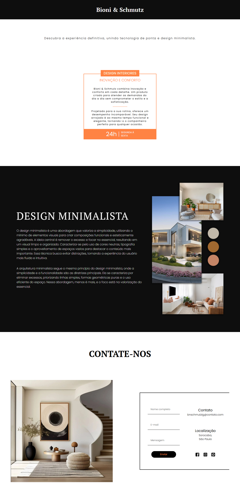
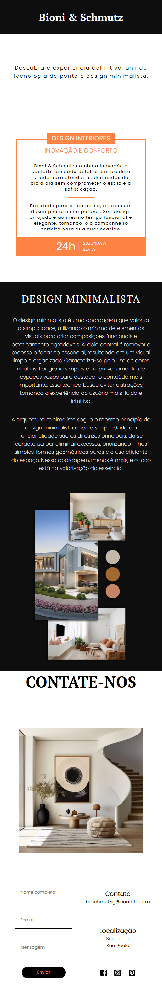

# Site Minimalista de Design de Interiores

Bem-vindo ao repositório do **Site Minimalista de Design de Interiores**! Este projeto foi criado para apresentar conceitos de design de interiores com foco em estética minimalista, destacando simplicidade, organização e sofisticação.

## 💡 Visão Geral

Este site é uma landing page moderna e elegante, projetada para estúdios de design de interiores ou profissionais independentes que desejam apresentar seu portfólio de forma clean e visualmente agradável. 

### 🖌️ Design e Estética
- **Estilo Minimalista**: Paleta de cores neutras, layout simples e uso inteligente de espaços em branco.
- **Tipografia Elegante**: Escolha de fontes sutis e modernas que complementam o estilo minimalista.
- **Imagens em Destaque**: Uso de fotos de alta qualidade para transmitir o visual dos projetos de design de interiores.

## 🎨 Paleta de Cores
- **Primária**: Tons de preto e branco, trazendo uma sensação de pureza e elegância.
- **Secundária**: Pequenos detalhes na cor laranja para dar um toque sutil de personalidade.

## 🛠️ Tecnologias Utilizadas

- **HTML5** e **CSS3**
- **JavaScript** para interações leves
- **SASS/SCSS** para modularidade no CSS

